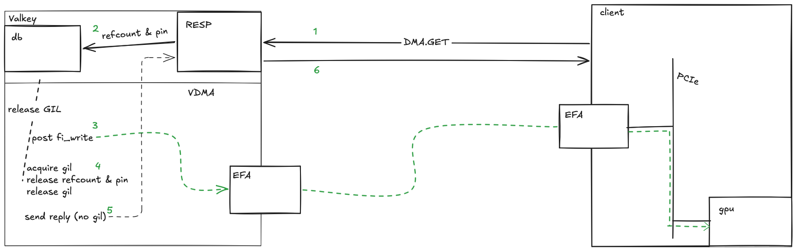

# VDMA: Low-latency bulk Valkey transfers with EFA

EFAs (Elastic Fabric Adapters) are available on AWS's most potent GPU instances, and
offer terabits of throughput per instance. Currently the popular way to get that kind
of throughput is by gpu-to-gpu transfers. GPU memory is expensive. Herein we propose
the design for Valkey to provide economical bulk storage for kvcache, and generally
for large items that demand high throughput with low latency.

# VDMA module requirements
* Lock-free, gil-free DMA into and out of Valkey's keyspace
* Zero-copy on both read and write
* Optionally DMA GPU memory without traversing host memory bus
* Use Valkey's fundamental scalar type, ValkeyString (set/get to same keyspace as dma.get/set)
  * Cluster and replication are non-goals for launch, but must be supportable by the module
    implementation for later addition.
* VDMA initiates all DMA - client exposes memory to server
* Use open source Valkey module apis
* Valkey RESP commands initiate and complete rpcs
* Optional payload checksums

# Safety
Blast radius of a central Valkey or cluster is greater than a client leaf.
Therefore, VDMA initiates all DMA. No client can refer to server memory directly.

Clients can choose any strategy for DMA memory eligibility registration to satisfy
their own security and latency requirements.

# Valkey module api requirements
https://github.com/valkey-io/valkey/pull/4050

* Reference a ValkeyString without holding the GIL
* Adopt an allocated ValkeyString's memory directly into the keyspace
* Allocate a ValkeyString without zeroing (tantamount to copy)

# Communication model

A worker thread per EFA manages libfabric resources. 1 client binds to 1 EFA thread.
If you want to have N EFA's worth of throughput, you bind N clients. EFA requires the
remote's address on the receiving side, so designing without affinity penalizes
performance multiple times.

# RESP: control channel
Standard RESP initiates and completes every transfer. It carries the client's buffer
advertisement and the result per RPC. The client advertises memory, and the server uses
it according to the control channel's instructions.

* `DMA.HELLO`: Server returns (hex) the fabric address of the efa worker assigned to this
  client. The client inserts it into its address vector before any RMA.
* `DMA.SET <address> <rkey> <remote-address> <length> <key> [<crc>]`: Client advertises
  a registered buffer (endpoint address, remote key, buffer virtual address) with a value.
  Server sizes the ValkeyString and dma-reads the payload straight into it. If requested,
  it verifies `<crc>` (mismatch aborts the write), and replies `<n_bytes>` over RESP.
* `DMA.GET <address> <rkey> <remote-address> <capacity> <key> [<crc-flag>]`: Client
  advertises a registered buffer and capacity. Server dma-writes the value into it (nil
  if absent, error if the value is larger than `capacity`). Replies `<n_bytes> [<crc>]`
  over RESP. Client verifies checksum if requested.
* `DMA.INFO` reports provider attributes (diagnostics).

# EFA-direct: data path
Server-initiated one-sided RMA via the `efa-direct` provider, zero-copy in/out of
ValkeyString memory. Valkey server is always the DMA initiator. Clients are passive
targets.

### Direction
* `DMA.GET`: `fi_writemsg` local -> peer using `FI_DELIVERY_COMPLETE` semantic
* `DMA.SET`: `fi_read` peer -> local.

### Async / in-flight
Posted DMA operations return immediately. Completions land on the completion queue keyed
by per-op context (`FI_CONTEXT2`). One worker per endpoint busy-polls that queue
(`fi_cq_read`) while any op is in flight. It drains new requests, posting up to an
in-flight cap, and reaps completions in batches. It hands completion batches back under
a single GIL acquisition. When nothing is outstanding it parks on the request channel (a
blocking `recv`) to release the thread.

### Addressing
The advertised `remote-address` is the client buffer's virtual address. Each client is
assigned a worker, and the worker `fi_av_remove`s the client buffer address on disconnect.

### GPUDirect (optional)
The client buffer may be GPU device memory exposed via dmabuf (`FI_HMEM` / `FI_MR_DMABUF`).
The server RMAs directly into/out of VRAM. Requires a p2p-capable instance (eligible
selection is fairly sparse).
