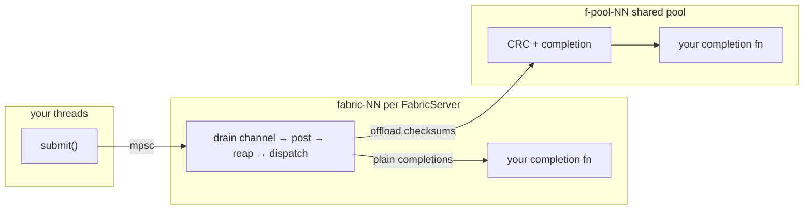

# Integrating dma-libfabric

`dma-libfabric` is the initiator half of a one-sided RMA data path. Your server defines a control
channel for peers. When a peer tells you where its registered buffer is, you hand `dma-libfabric` a
transfer request. `dma-libfabric` transfers the bytes with `fi_writemsg` or `fi_read` according to
which direction the transfer is going, and hands you back the context you supplied.

This library owns the libfabric endpoints and the driver threads.

The "peer" is a passive target, or a "client."

# What you provide

**A per-op context type.** A `Send + 'static` type you use for completions. It bundles with the
request and comes back to you at completion. It must implement `Operands`, which is how local memory
is provided:

```rust
pub trait Operands {
    /// The bytes a `ToPeer` transfer sends.
    fn source(&self) -> Option<&[u8]> { None }
    /// The buffer a `FromPeer` receives into.
    fn allocate(&mut self, length: usize) -> Option<&mut [u8]> { None }
    /// A span around the operand whose registration may outlive this transfer.
    fn cacheable_span(&self) -> Option<CacheableSpan> { None }
}
```

Both operand methods default to unsupported, so a context must implement the direction it serves.
A transfer whose direction has no operand fails. `Vec<u8>` implements both, so it works as a
context if you want to use it to get started. `cacheable_span` is an optimization, covered under
"Memory your allocator owns" below.

**A completion hook**, `BatchCompleter<T> = Box<dyn Fn(Drain<Completion<T>>) + Send + Sync>`. This
receives batches of completions. Batches are done to try to minimize downstream synchronization
costs.

**Configuration**: Providers, interface names, source bind address, in-flight cap (default 64)

**A `Pool`**, to be shared by each libfabric server.

# Threads

There are 2 classes of threads in `dma-libfabric`.



`FabricServer` is `Send + Sync`, so your threads may `submit` concurrently. `submit` is a non-blocking
channel send. It returns `Err` when the worker is gone.

`FabricServer::start` spawns a thread, `fabric-00`, `fabric-01`, etc. It drives the endpoint
and does the libfabric needful. It drains the submission channel without blocking, posts transfers
up to the in-flight cap, coalesces completions, and dispatches each completion with its `op_context`.

The pool threads, `f-pool-nn`, run any CRC and completion of checksummed transfers. This keeps hashing
payloads from stalling the post-and-reap driver loop. If you don't use checksums these threads won't do
anything.

### Your hooks
Your completion hook is `Fn`, and it is `Send + Sync` because it is called from the fabric worker and
from pool threads, possibly at the same time. Anything mutable inside it must be synchronized.
`Operands::source` and `Operands::allocate` run on the fabric worker synchronously per worker, before
the transfer is posted. Be quick.

Do not block your hooks. Time spent in your hooks on the fabric worker is time that libfabric endpoint
is not posting or reaping, which delays every transfer on that device. Heavy or lock-contended work
belongs on separate threads.

Avoid panics.

# Interaction model

1. **Open.** `Pool::new`, then `FabricServer::start` per device. `start` blocks until the endpoint is
   open or fails.
2. **Advertise.** `local_address()` is the initiator's fabric address. On `efa-direct` a target must
   hold it in its own address vector before you RMA against it. That means your control channel has to
   deliver every device's address, since any of them may serve a given transfer.
3. **Transfer.** Build and submit a `TransferRequest`, which is your `client_id`, a peer address, remote
   key, remote address, direction (`ToPeer`, or `FromPeer { length }` for how many bytes to read),
   choice of CRC, your context, and a `parent_id`: the `tracing` span id to parent the on-wire span
   under, or `None`. (Keep that `client_id` stable for the life of your client and don't reuse
   client ids)
4. **Complete.** Your hook receives `Completion { caller_context, outcome }`. Completions are unordered
   with respect to submission.
5. **Disconnect.** `remove_peer(client_id)` drops that id's address-vector entry. It is ordered after
   transfers you already submitted on that server, and the worker defers it until that id's in-flight
   ops drain. Tell every server that could have ever served this client_id (or all of them).
6. **Shut down.** Dropping `FabricServer` closes the channel. The worker drains what is in flight,
   completes it through your hook, and joins.

The submission channel doesn't model backpressure on your behalf. `FabricServer::outstanding()` counts
submitted but unfinished transfers, and is useful for balancing across devices or throttling.

# Awaiting instead of a completion hook

`asynchronous::FabricServer` is the same server with futures in place of `BatchCompleter`. It installs
its own completion hook. `transfer` hands you a future that resolves to your outcome and context.

```rust
let server: asynchronous::FabricServer<Operation> = asynchronous::FabricServer::start(&config, pool)?;
// `Err` hands the request back, with your context in it, when the worker is gone.
let Ok(transfer) = server.transfer(request) else {
    return Err(DmaError::Fabric("fabric worker is gone".into()));
};
let (outcome, operation) = transfer.await;
```

`Transfer` is a plain `Future`, and doesn't expect any particular hosting runtime. It uses Wakers directly.

**Dropping the future abandons the transfer, but does not release the memory.** The RMA is posted and there
is no way to cancel it. On a dropped Transfer, your context is dropped. You should release any held operand
memory on context drop.

# Buffers and memory

The operand your context hands over must stay where it is, unmodified, until the completion comes
back. The worker holds your context, so bytes your context owns are expected to be owned. Nothing else may
write them until completion.

EFA requires `FI_MR_LOCAL`. Every local operand must be registered, and `fi_mr_reg` costs time.
`dma-libfabric` therefore optionally caches registrations. There are two ways to opt in, depending on
whether you own the memory.

## Memory you own

`FabricServer::register` takes your storage and pins it on that server's domain, handing back a
`MemoryRegion<S>`:

```rust
let region = server.register(vec![0u8; 64 * 1024 * 1024])?;
```

Every operand inside the span is then a cache hit with no `fi_mr_reg` at all. Hold a clone of the
`MemoryRegion` in the context of any transfer whose operand lives there — that is what keeps the
storage mapped for the transfer. Dropping the last clone deregisters, then frees, in that order.

Registering the same storage on several servers pins it once per device against `RLIMIT_MEMLOCK`, so
prefer one region per device and route its traffic to that server. See
`examples/registered_arena.rs`.

## Memory your allocator owns

A registration pins the physical pages present when it was taken and goes stale when your allocator
reclaims them. That may be jemalloc, or a custom memory pool, or some other thing. Answer a
`CacheableSpan` from your context to say a registration over it may be kept:

```rust
impl Operands for MyContext {
    fn cacheable_span(&self) -> Option<CacheableSpan> {
        CacheableSpan::new(self.base, self.length)
    }
}
```

It is asked once per cache miss, on the worker and after the operand resolves, so a landing buffer
your `allocate` just produced can answer for itself. Return `None` for any operand you can't
guarantee will result in an `invalidate()` call, and it safely falls back to a per-operation
registration. In exchange for returning `Some`, you promise to call
`dma_libfabric::invalidate(start, end)` over that span before its pages are reclaimed or moved.

The span may be wider than the operand, and widening it is the point: a span covering a whole
allocator extent lets every operand landing in it share one registration. It must contain the
operand — one that doesn't is ignored, since registering it would pin the wrong memory. Note that
reusing or rewriting the memory is fine. So if you have a buffer pool you reuse, you don't have to
invalidate when you rewrite something in the buffer. You only need to invalidate if you are going to
resize/reallocate the buffer or free it. This also means you _could_ use a fixed buffer pool strategy
and just trivially answer a span forever and never call invalidate.

If you answer `None` everywhere, everything still works. Each local operand is registered and closed
per transfer, which is still correct but probably slower.

The vdma module implements this with jemalloc extent hooks, hooking the arena backing an operand
before answering for it. An `munmap` interposer or a slab allocator with a free callback would do the
same thing.

# Providers

`Provider::Tcp` is for development on loopback.

`Provider::EfaDirect` is the aws hardware path. The `efa` libfabric provider with the `efa-direct`
fabric name is used, rather than the rxr software path. It requires `FI_CONTEXT2`, which the worker
satisfies internally and ties to your request context.

One endpoint is one device. `discover_domains` gives you a list. Start one `FabricServer` for each and
choose which FabricServer to use per transfer based on `outstanding()` (or however you want).

# What it does not do

`dma-libfabric` neither takes a position on nor provides a control channel, serialization, client,
retry policy, reconnection, ordering between transfers, or backpressure. Failed transfers are reported
back to your completion hook in the `Outcome`. What that means for each transfer and your users is
freely yours to decide.
