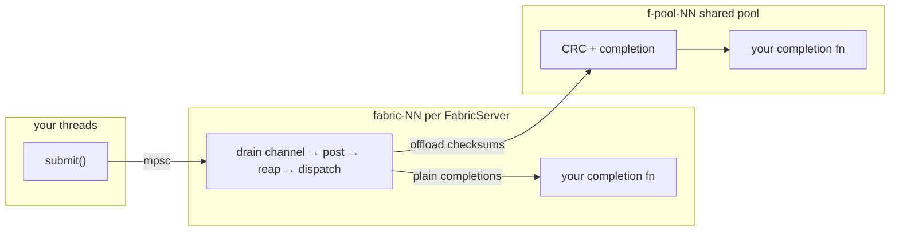

# Integrating dma-libfabric

`dma-libfabric` is the initiator half of a one-sided RMA data path. Your server defines a control
channel for peers. When a peer tells you where its registered buffer is, you hand `dma-libfabric` a
transfer request. `dma-libfabric` transfers the bytes with `fi_writemsg` or `fi_read` according to
which direction the transfer is going, and hands you back the context you supplied.

This library owns the libfabric endpoints and the driver threads.

The "peer" is a passive target, or a "client."

# What you provide

**A per-op context type.** A `Send + 'static` type you use for completions. It bundles with the
request and comes back to you at completion. It must implement `DestinationAllocator`, which the
worker calls to choose the buffer for a `FromPeer` transfer. `ToPeer` transfers carry their source
buffer in the request instead.

**A completion hook**, `BatchCompleter<T> = Box<dyn Fn(Drain<Completion<T>>) + Send + Sync>`. This
receives batches of completions. Batches are done to try to minimize downstream synchronization
costs.

**Configuration**: Providers, interface names, source bind address, in-flight cap (default 64), and
CRC pool size.

**A `Pool`**, to be shared by each libfabric server.

# Threads

There are 2 classes of threads in `dma-libfabric`.



`FabricServer` is `Send + Sync`, so your threads may `submit` concurrently. `submit` is a non-blocking
channel send. It returns `Err` when the worker is gone.

`FabricServer::start` spawns a thread, `fabric-00`, `fabric-01`, etc. It drives the endpoint
and does the libfabric needful. It drains the submission channel without blocking, posts transfers
up to the in-flight cap, coalesces completions, and dispatches each completion with its `op_context`.

The pool threads, `f-pool-nn`, run any CRC and completion of checksummed transfers. This keeps hashing
payloads from stalling the post-and-reap driver loop. If you don't use checksums these threads won't do
anything.

### Your hooks
Your completion hook is `Fn`, and it is `Send + Sync` because it is called from the fabric worker and
from pool threads, possibly at the same time. Anything mutable inside it must be synchronized.
`DestinationAllocator::allocate` runs on the fabric worker synchronously per worker. Allocate quickly.

Do not block your hooks. Time spent in your hooks on the fabric worker is time that libfabric endpoint
is not posting or reaping, which delays every transfer on that device. Heavy or lock-contended work
belongs on separate threads.

Do not panic. The fabric worker has no guard against panic. A panic in your hook unwinds and kills the
worker. In-flight transfers are stranded with no completion, and every later `submit` returns `Err`.
The failure surfaces to in-flight callers as a hang. Catch your own panics if your completion path can
produce one.

# Interaction model

1. **Open.** `Pool::new`, then `FabricServer::start` per device. `start` blocks until the endpoint is
   open or fails.
2. **Advertise.** `local_address()` is the initiator's fabric address. On `efa-direct` a target must
   hold it in its own address vector before you RMA against it. That means your control channel has to
   deliver every device's address, since any of them may serve a given transfer.
3. **Transfer.** Build and submit a `TransferRequest`, which is your `client_id`, a peer address, remote
   key, remote address, byte buffer, direction, choice of CRC, and your context. (Keep that `client_id`
   stable for the life of your client and don't reuse client ids)
4. **Complete.** Your hook receives `Completion { caller_context, outcome }`. Completions are unordered
   with respect to submission.
5. **Disconnect.** `remove_peer(client_id)` drops that id's address-vector entry. It is ordered after
   transfers you already submitted on that server, and the worker defers it until that id's in-flight
   ops drain. Tell every server that could have ever served this client_id (or all of them).
6. **Shut down.** Dropping `FabricServer` closes the channel. The worker drains what is in flight,
   completes it through your hook, and joins. Requests still queued are failed with
   `fabric worker is gone`.

The submission channel doesn't model backpressure on your behalf. `FabricServer::outstanding()` counts
submitted but unfinished transfers, and is useful for balancing across devices or throttling.

# Awaiting instead of a completion hook

`asynchronous::FabricServer` is the same server with futures in place of `BatchCompleter`. It installs
its own completion hook. `transfer` hands you a future that resolves to your outcome and context.

```rust
let server: asynchronous::FabricServer<Operation> = asynchronous::FabricServer::start(&config, pool)?;
let (outcome, operation) = server.transfer(request)?.await;
```

`Transfer` is a plain `Future`, and doesn't expect any particular hosting runtime. It uses Wakers directly.

**Dropping the future abandons the transfer, but does not release the memory.** The RMA is posted and there
is no way to cancel it. On a dropped Transfer, when the completion lands your context is dropped. Your
context's `Drop` must release whatever `allocate` returned, and you mustn't modify the memory before then.

# Buffers and memory

A `TransferBuffer` is a raw pointer and length. It must stay pinned and unmodified in memory until its
completion is handed back. That invariant must be upheld for its `unsafe impl Send` to hold.

EFA requires `FI_MR_LOCAL`. Every local operand must be registered, and `fi_mr_reg` costs time.
`dma-libfabric` therefore optionally caches registrations, but the cache requires you to install a
`ReclaimNotifier`. A registration pins the physical pages present when it was taken and goes stale
when your allocator reclaims them. That may be jemalloc, or it may be a custom memory pool, or some
other thing.

```rust
pub trait ReclaimNotifier: Send + Sync {
    fn covers(&self, pointer: *mut u8, length: usize) -> bool;
}
```

`covers` is asked once per cache miss, before the extent is registered: answer `false` for any pointer
you can't guarantee will result in an `invalidate()` call, and that operand safely falls back to a
per-operation registration. In exchange for returning true, you promise to call
`dma_libfabric::invalidate(start, end)` over this range before its pages are reclaimed or moved. Note
that reusing or rewriting the memory is fine. So if you have a buffer pool you reuse, you don't have to
invalidate when you rewrite something in the buffer. You only need to invalidate if you are going to
resize/reallocate the buffer or free it. This also means you _could_ use a fixed buffer pool strategy
and just trivially return true forever and never call invalidate.

Install a ReclaimNotifier once at startup, before any transfer. If you skip it, everything still works.
Each local operand is registered and closed per transfer, which is still correct but probably slower.

The vdma module implements this with jemalloc extent hooks. An `munmap` interposer or a slab
allocator with a free callback would do the same thing.

# Providers

`Provider::Tcp` is for development on loopback.

`Provider::EfaDirect` is the aws hardware path. The `efa` libfabric provider with the `efa-direct`
fabric name is used, rather than the rxr software path. It requires `FI_CONTEXT2`, which the worker
satisfies internally and ties to your request context.

One endpoint is one device. `discover_domains` gives you a list. Start one `FabricServer` for each and
choose which FabricServer to use per transfer based on `outstanding()` (or however you want).

# What it does not do

`dma-libfabric` neither takes a position on nor provides a control channel, serialization, client,
retry policy, reconnection, ordering between transfers, or backpressure. Failed transfers are reported
back to your completion hook in the `Outcome`. What that means for each transfer and your users is
freely yours to decide.
